# AI-Enhanced-F1-Simulator
<p align="center">
  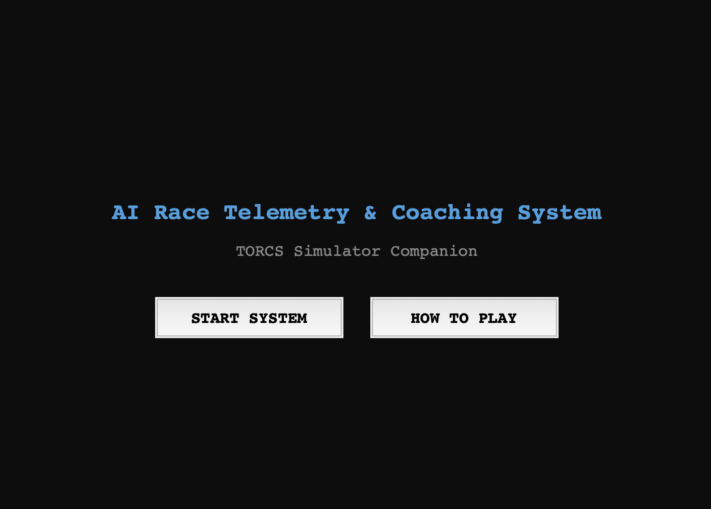
</p>
<p align="center">
  <a href = "https://youtu.be/kEXgGcCtlPY"><b>👉Click here to watch demo video👈</b></a>
</p>

AI-Enhanced F1 Simulator is a real-time racing coach built on the open-source TORCS simulator. The system compares a driver's live telemetry against the championship-winning Ahura racing agent to spot performance gaps. Powered by local IBM Granite models running via Ollama, it delivers instant voice and text guidance during the race, along with detailed post-race analysis to help drivers improve their lap times.

## Table of Contents
- [1. Prerequisites & Environment Setup](#1-prerequisites--environment-setup)
  - [1.1 System Requirements](#11-system-requirements)
  - [1.2 Repository & Dependency Installation](#12-repository--dependency-installation)
  - [1.3 Local AI Model Setup (Ollama & Granite 2B)](#13-local-ai-model-setup-ollama--granite-2b)
- [2. TORCS & Telemetry Configuration](#2-torcs--telemetry-configuration)
  - [2.1 TORCS Installation & Setup](#21-torcs-installation--setup)
  - [2.2 Configuring TORCS Race & Telemetry Server](#22-configuring-torcs-race--telemetry-server)
  - [2.3 Telemetry Integration Architecture](#23-telemetry-integration-architecture)
- [3. IBM Granite / Local LLM Integration](#3-ibm-granite--local-llm-integration)
  - [3.1 Connection Architecture](#31-connection-architecture)
  - [3.2 Configuration](#32-configuration)
  - [3.3 Prompt Structure](#33-prompt-structure)
- [4. Pipeline Architecture & Core Middleware](#4-pipeline-architecture--core-middleware)
  - [4.1 Hybrid Architecture & Data Flow](#41-hybrid-architecture--data-flow)
  - [4.2 Core Python Modules & Data Architecture](#42-core-python-modules--data-architecture)
  - [4.3 Telemetry Analysis & Live Coaching](#43-telemetry-analysis--live-coaching)
  - [4.4 Priority-Based Audio Management](#44-priority-based-audio-management)
  - [4.5 Dashboard](#45-Dashboard)
- [5. Step-by-Step Execution Guide](#5-step-by-step-execution-guide)
  - [5.1 Execution Guide](#51-execution-guide)
  - [5.2 TORCS Game Controls & Display Shortcuts](#52-torcs-game-controls--display-shortcuts)
- [6. Expected Results & Verification](#6-expected-results--verification)
  - [6.1 Initialization & RAG Knowledge Base Loading](#61-initialization--rag-knowledge-base-loading)
  - [6.2 Handshake & Multiprocessing Input Startup](#62-handshake--multiprocessing-input-startup)
  - [6.3 Real-Time Coaching](#63-real-time-coaching)
  - [6.4 Post-Race Summary & Graceful System Shutdown](#64-post-race-summary--graceful-system-shutdown)
- [Appendix: Acquiring Expert Telemetry](#appendix-acquiring-expert-telemetry)

## 1. Prerequisites & Environment Setup
Before running the AI-Enhanced F1 Simulator, ensure your system satisfies the hardware/OS requirements, runtime environments, and local AI model dependencies detailed below.

### 1.1 System Requirements
> **Supported platforms:** macOS and Windows only. Linux is not supported - the upstream TORCS `scr_server` telemetry option this project depends on cannot be built/installed on Linux, which is outside this project's control.

* **Operating System:** 
  * **Windows:** Windows 10/11.
  * **macOS:** macOS 12+ (Intel / Apple Silicon). *Note: Running TORCS on macOS requires [Wine](https://www.winehq.org/) to emulate the x86/Windows environment.*
* **RAM:** Minimum 8 GB (16 GB recommended to handle simultaneous simulation and LLM inference).
* **Python Environment:** Python 3.13.0+ (ensure `pip` and `venv` are configured).

> **Cross-Platform Note on Terminal Commands:**
> * **Python Executable:** Use `python3` on macOS and `python` (or `py`) on Windows.
> * **Virtual Environment Activation:** 
>   * macOS: `source venv/bin/activate`
>   * Windows: `.\venv\Scripts\activate`
> * **Path Separators:** Replace `/` with `\` if you are using Windows CMD/PowerShell.
---
### 1.2 Repository & Dependency Installation

Clone the repository and install the necessary Python packages in a virtual environment:

```bash
# Clone the repository
git clone https://github.com/F1-Group/AI-Enhanced-F1-Simulator.git

cd AI-Enhanced-F1-Simulator/

# Create virtual environment
# macOS
python3 -m venv venv  
# Windows
python -m venv venv

# Activate virtual environment
# macOS
source venv/bin/activate  
# Windows
venv\Scripts\activate

# One-line dependency installation
pip install -r requirements.txt
```
---
### 1.3 Local AI Model Setup (Ollama & Granite 2B)
The coaching middleware uses a localized, offline **Ollama** server running **IBM Granite 2B** weights to eliminate cloud API latency and avoid token limits.
#### Step 1: Install Ollama
Open a new terminal window.
* **macOS:** Download and install the application directly from [Ollama.com](https://ollama.com/download/mac) or install via Homebrew:
  ```bash
  # Install Homebrew if not already installed
  brew install ollama
  ```

* **Windows:** Download and run the installer directly from [Ollama.com](https://ollama.com/download/windows) or install via PowerShell:
  ```bash
  irm https://ollama.com/install.ps1 | iex
  ```

#### Step 2: Pull the Granite 2B Model
Pull the specific 2B dense model weights to your local machine:
```bash
ollama pull granite3-dense:2b
```

#### Step 3: Verify Ollama Service
Ensure the Ollama service is active and accessible locally on http://localhost:11434:
```bash
ollama list
```
*(You should see `granite3-dense:2b` listed in the installed models output.)*

Test if the model loads and responds properly in your terminal:
```bash
ollama run granite3-dense:2b "Hello"
```
*(Confirm that the model generates a response without memory or loading errors, then exit the prompt using /bypass or Ctrl+D.)*

Close the terminal window.

## 2. TORCS & Telemetry Configuration
This section guides you through installing the **TORCS (The Open Racing Car Simulator)** simulator and configuring its telemetry server to stream vehicle data (`scr_server`) over UDP sockets to the Python coaching middleware.
### 2.1 TORCS Installation & Setup
TORCS is supported natively on Windows, while macOS requires **Wine** emulation.

#### A. Windows Installation
1. Download and unzip `torcs.zip` from the [Link](https://drive.google.com/file/d/1aJni3MQl82gNy2QpoM6IKRdqoTUjGNQd/view?usp=sharing).
2. Verify `torcs\wtorcs.exe` is executable.

#### B. macOS Installation (via Wine)
Running TORCS on macOS requires running the Windows binary under **Wine**.
1. Download and unzip `torcs.zip` from the [Link](https://drive.google.com/file/d/1aJni3MQl82gNy2QpoM6IKRdqoTUjGNQd/view?usp=sharing) to your preferred directory (e.g., `$HOME/torcs` or `/Applications/torcs`)..
2. Install Wine via Homebrew or [Wine Download](https://www.winehq.org/):
    ```bash
    # Install Homebrew if not already installed
    brew install --cask wine-stable
    ```
3. Open **System Settings > Privacy & Security** on your Mac and grant execution permissions to Wine.
4. Launch TORCS using one of the following methods:
  - **Via Wine Terminal:**
    Open Wine application.
    ```bash
    wine /path/to/your/torcs/torcs/wtorcs.exe
    ```
    *(Replace /path/to/your/torcs with your actual installation directory path.)*
  - **Via Finder (Right-Click):** Open Finder, navigate to your TORCS directory, right-click wtorcs.exe, select Open With, and choose Wine (or Wine Stable).

> **Warning for macOS Users:**
Running TORCS inside Wine on macOS can occasionally crash or freeze upon launching a track or loading graphical textures. If TORCS crashes unexpectedly, close the Wine process completely, re-launch, and try again. You may need to attempt launching the race 2–3 times before it runs stably.

---
### 2.2 Configuring TORCS Race & Telemetry Server
To allow the Python middleware to capture telemetry data and send control commands, TORCS must launch with `scr_server` enabled.

1. Launch **TORCS** (wtorcs.exe)
2. Navigate to: **Race** $\rightarrow$ **Quick Race** $\rightarrow$ **Configure Race**
<p align="center">
  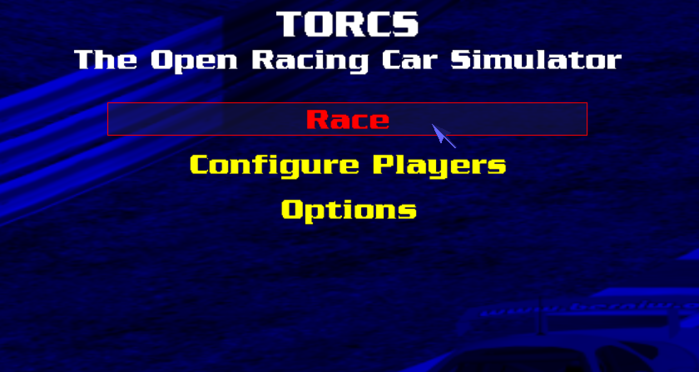
  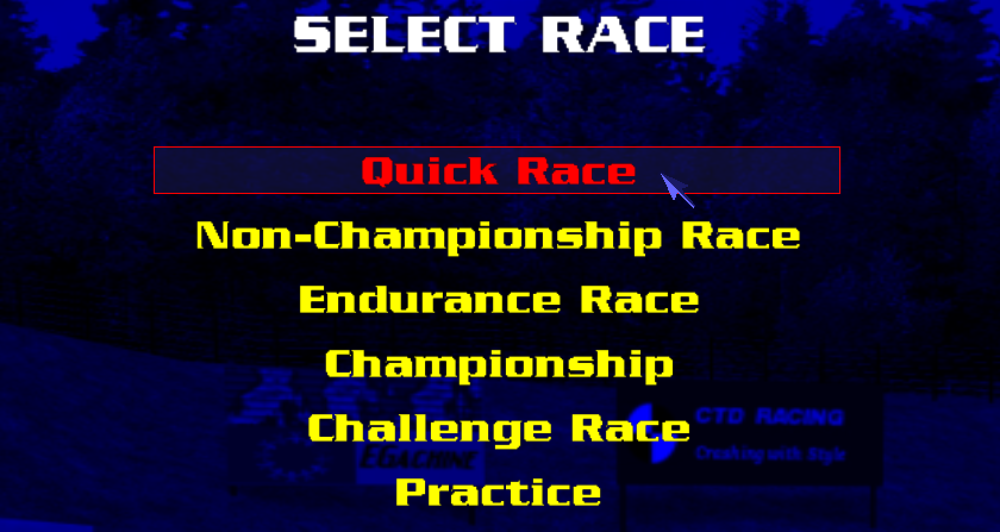
  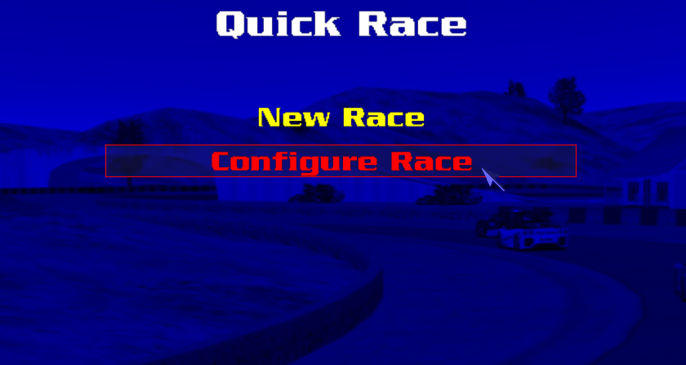
</p>

3. **Select Track:** **Olethros Road 1**
<p align="center">
  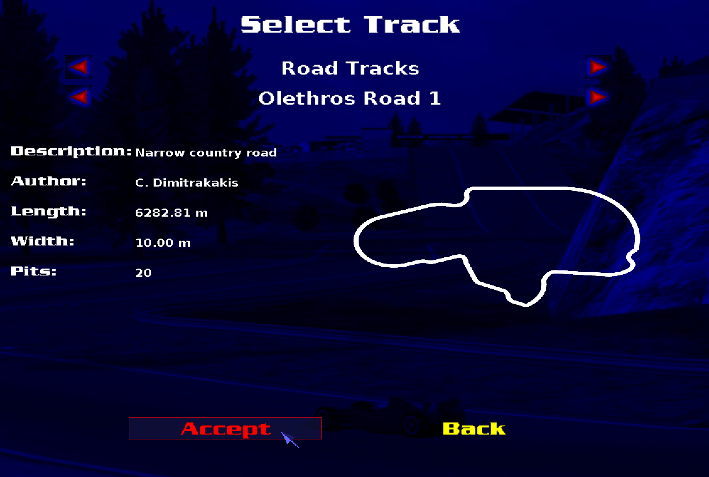
</p>

4. **Select Drivers:** Make sure `scr_server 1` is selected and added to the driver list. This enables the UDP socket server for AI driver integration.
<p align="center">
  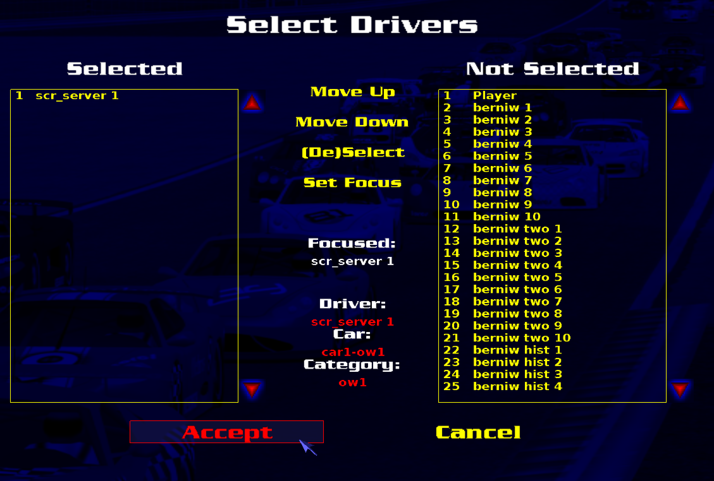
</p>

5. Click **New Race**
<p align="center">
  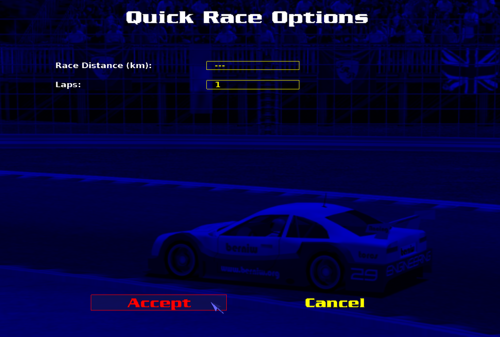
  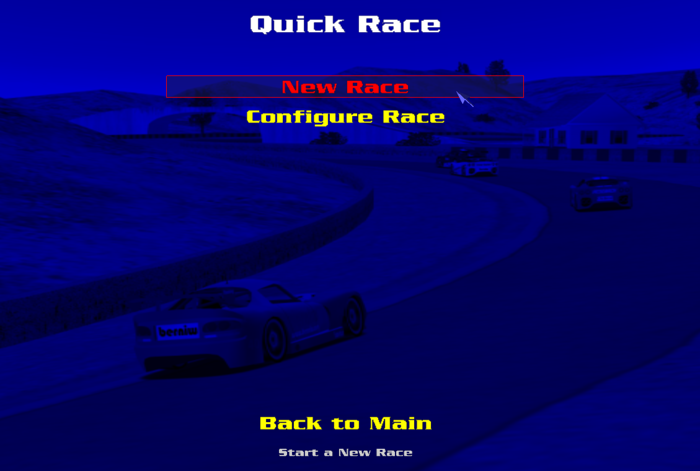
</p>

6. The simulator will pause and display: `Initializing Driver scr_server 1`
<p align="center">
  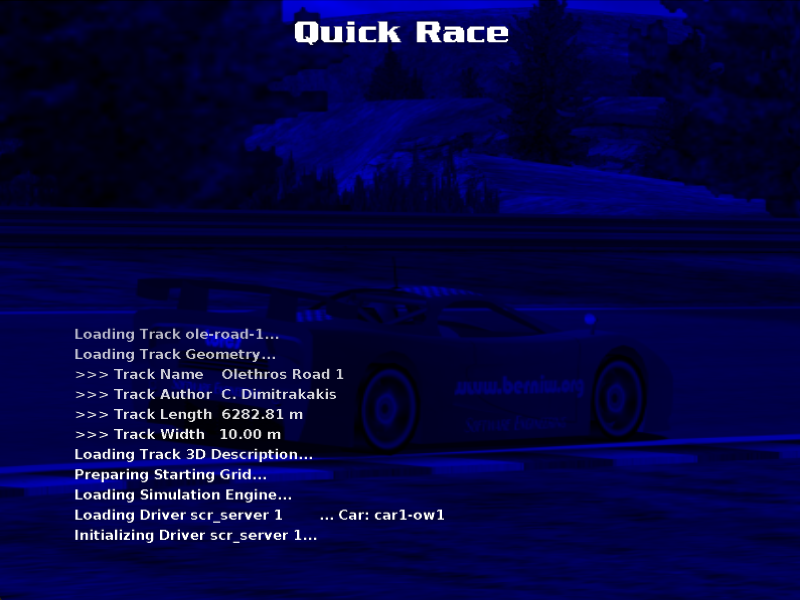
</p>

*It is now waiting for the Python middleware client to connect over UDP.*

---
### 2.3 Telemetry Integration Architecture
The interaction between the simulator and the client application operates as a low-latency, bidirectional socket pipeline:
<p align="center">
  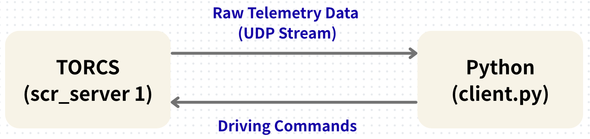
</p>

* **Raw Telemetry Data (UDP Stream):** `TORCS (scr_server 1)` streams live vehicle status and track sensor metrics to `Python (client.py)` over a UDP socket.
* **Driving Commands:** Based on incoming telemetry and control logic, `Python (client.py)` computes and sends actionable control inputs back to the TORCS server in real time.

## 3. IBM Granite / Local LLM Integration

Every coaching line comes from **IBM Granite 2B** (`granite3-dense:2b`), running locally through **Ollama**. No API key, no network call during inference.

### 3.1 Connection Architecture

`llm/llm_client.py` handles the connection using the official `ollama` Python package. Ollama runs at `http://localhost:11434` by default:

```python
import ollama

MODEL_NAME = "granite3-dense:2b"
REQUEST_TIMEOUT_SECONDS = 10
_client = ollama.Client(timeout=REQUEST_TIMEOUT_SECONDS)
```

When the system starts, it automatically checks if Ollama is running, starts it if not, and sends a warmup message to load the model into memory before the race begins.

---

### 3.2 Configuration

No API key needed. There are only two settings to know about:

| Setting | Default | Purpose |
| :--- | :--- | :--- |
| `MODEL_NAME` | `"granite3-dense:2b"` | Which Ollama model to use. Must be pulled first with `ollama pull <name>`. |
| `REQUEST_TIMEOUT_SECONDS` | `10` | How long to wait before giving up on a slow response. |

To switch to a different model or a non-default Ollama host, edit these two lines in `llm/llm_client.py`:

```python
MODEL_NAME = "granite3-dense:8b"

_client = ollama.Client(
    host="http://127.0.0.1:11434",
    timeout=REQUEST_TIMEOUT_SECONDS,
)
```

Then pull the new model first:

```bash
ollama pull granite3-dense:8b
```

---

### 3.3 Prompt Structure

Each coaching call sends Granite two messages:

```python
messages = [
    {"role": "system", "content": system_prompt},  # persona, from coaching_style.py
    {"role": "user",   "content": user_prompt},     # telemetry + context, from prompts.py
]
```

The system prompt picks one of three coaching personas (`aggressive`, `supportive`, `technical`; default is `technical`). All three share the same core rules: never invent a number that is not in the telemetry, and reply like a real race engineer on the radio.

The user prompt formats the live telemetry as plain text:

```text
TELEMETRY DATA:
- Lap distance: 1820.5m
- Speed: 212.4 km/h
- Track position: 0.15
- Car angle: 0.03
- Wheel spin: 0.12
- Lap time: 88.3s
- Throttle: 0.68
- Brake: 0.45
- Steering: -0.12
- Gear: 5
- RPM: 11200

COACHING CONTEXT: Brake 25m earlier before T1.

REPLY IN ONE SENTENCE ONLY. Maximum 20 words.
```

The 20-word limit keeps responses short enough to speak aloud without falling behind the live race.

## 4. Pipeline Architecture & Core Middleware

This section outlines the custom Python middleware architecture designed to resolve data isolation, handle high-frequency vehicle telemetry streaming, and process high-latency LLM inference.

### 4.1 Hybrid Architecture & Data Flow

To manage the high frequency of incoming UDP data alongside the higher latency of LLM inference, the middleware applies a **Lambda-inspired hybrid architecture** containing parallel **Fast** and **Slow** processing layers.

<p align="center">
  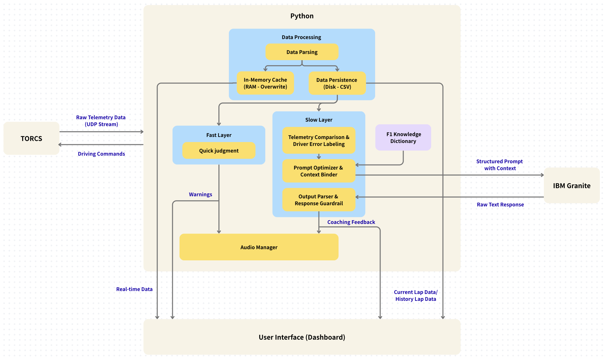
</p>

1. **Telemetry Ingestion & Human Input Intercept:** The `Client` class connects to TORCS (`scr_server`) via UDP on port `3001` to receive continuous raw telemetry packets. Simultaneously, the dedicated `Input` process intercepts player keyboard commands asynchronously, which `Controller` converts into continuous control values to drive the vehicle.
2. **Fast Layer (Rule-Based Alerts):** Reads the latest telemetry directly from the thread-safe cache. Deterministic rules bypass LLM latency to provide immediate braking, wrong-way, and gear-shift voice prompts. Off-track events remain visible on the dashboard and in logs, but their audio is intentionally disabled.
3. **Slow Layer (LLM Race Engineering):** Stores telemetry logs to disk and conducts lap comparisons against expert driving benchmarks. Dynamic error labels, background domain knowledge (F1 rules, track layout heuristics), and telemetry metrics are combined into structured prompts fed into the **IBM Granite 2B** model via Ollama. Validated AI responses are delivered as high-level race coaching advice.

---

### 4.2 Core Python Modules & Data Architecture

To prevent high-frequency UDP socket traffic from being blocked by disk I/O operations or heavy computation tasks, the middleware follows the **Single Responsibility Principle** using Python's `threading` and `multiprocessing` libraries.

| Module / Class | Role & Architectural Responsibility |
| :--- | :--- |
| `main.py` | **Main Entry Point:** Initializes global resources, launches background processes, and configures worker threads running in parallel without blocking system execution. |
| `cache.py` | **Thread-Safe Global Cache:** Acts as the shared state container tracking live telemetry and game state. Uses `threading.Lock()` to manage safe concurrent read/write operations across modules. |
| `Client` (`client.py`) | **UDP Network & Lifecycle Manager:** Handles UDP socket communication on port `3001` with TORCS (`scr_server 1`). Manages game lifecycles via a Finite State Machine (FSM) triggered by UDP timeouts. |
| `Input` (`input.py`) | **Asynchronous Keyboard Process:** Operates in a dedicated child process (`multiprocessing.Process`) to capture raw human keyboard input in real time, bypassing Python's GIL to ensure zero latency. |
| `Controller` (`controller.py`) | **Input Translator:** Converts raw binary keyboard events captured from `Input` into precise continuous floating-point signals for vehicle steering, braking, and throttle application. |

### 4.3 Telemetry Analysis & Live Coaching

The `analysis/` package converts raw TORCS telemetry into measurable, location-specific coaching events. Instead of comparing the player and expert at the same timestamp, both laps are aligned by **lap distance**. This allows the system to compare braking, speed, racing line, and throttle at the same physical point on the track.

#### Analysis Pipeline

1. **Telemetry cleaning and lap segmentation (`lap_utils.py`)**
   - Removes physically implausible collision-related speed spikes above `600 km/h` and interpolates across invalid samples.
   - Detects a new lap when `lap_distance` drops by more than `500 m`.
   - Removes duplicate or backwards distance samples caused by stopping, spinning, or reversing.

2. **Distance-based alignment (`alignment.py`)**
   - Resamples expert telemetry onto a shared distance grid at `5 m` intervals.
   - Builds a standing-start baseline from expert lap 1 or a flying-lap baseline from expert laps 2 and above.
   - Calculates player-minus-expert deltas for lap time, speed, track position, angle, wheel spin, throttle, brake, and steering.
   - Marks future, unreached positions during live analysis so they cannot generate false errors.

3. **Corner and error detection (`error_detection.py`)**
   - Detects corners automatically from sustained steering activity in the expert baseline.
   - Divides each corner into approach, apex, and exit regions.
   - Generates structured errors containing type, location, severity, confidence, coaching hint, related telemetry, and measured evidence.

4. **Live orchestration (`live_coach.py`)**
   - Follows the active CSV referenced by `data/latest_data.txt` and runs the Fast Layer on every incoming frame.
   - Creates a real-time Slow Layer snapshot every `0.75 s` once sufficient data is available.
   - Analyses completed laps on background workers so pandas processing and AI inference do not block telemetry ingestion.
   - Applies location-based deduplication and per-error cooldowns before publishing events.
   - Publishes no more than three Slow Layer errors per analysis pass to avoid overwhelming the driver.

5. **Offline analysis and deterministic replay**
   - `run_analysis.py` compares a recorded player CSV with the expert baseline and writes structured JSON reports.
   - `replay.py` streams a recorded CSV at the original `50 Hz` rate, or faster, enabling repeatable coaching and latency tests without launching TORCS.

#### Detected Driving Errors

| Error Type | Detection Meaning | Layer |
| :--- | :--- | :--- |
| `brake_now` | The player approaches a corner at least `25 km/h` faster than the expert while applying less than `0.30` brake. | Fast |
| `off_track` | Absolute TORCS track position exceeds `1.0`. Detection and dashboard logging remain active, but audio is intentionally disabled. | Fast |
| `wrong_way` | The vehicle travels at least `10 m` in the reverse track direction, above `20 km/h`, for at least `1.5 s`; announces “Wrong way. Turn around.” once per incident. | Fast |
| `shift_up` | On a stable, on-track line with at least `70%` throttle, engine speed remains at or above `8800 RPM` for `0.6 s`; announces “Shift up.” once for that gear. | Fast |
| `shift_down` | On a stable, on-track line while braking at least `30%` with throttle released, engine speed remains at or below `4500 RPM` for `0.6 s` in a safe speed range; announces at most one “Shift down.” per braking episode. | Fast |
| `late_braking` | The player's braking point is at least `25 m` later than the expert, or the player reaches the corner too fast without braking. | Slow |
| `poor_corner_exit` | Mean exit speed is at least `12 km/h` below the expert baseline. | Slow |
| `poor_track_position` | Mean racing-line deviation through a corner is at least `0.35` relative to the expert. | Slow |
| `unstable_throttle` | Player throttle variation through a corner exceeds expert variation by at least `0.15`. | Slow |
| `sector_time_loss` | The player loses at least `2.0 s` against the expert within one of three equal-distance sectors. | Slow |

Fast Layer events are deterministic and bypass Granite generation. `brake_now`, `wrong_way`, `shift_up`, and `shift_down` are spoken immediately, while `off_track` is shown and logged without audio. Slow Layer events contain measured evidence and are passed to the RAG and Granite pipeline for concise, context-aware coaching. Real-time analysis ignores corners already passed by the vehicle, while completed-lap analysis evaluates every corner.

The analysis report follows this general structure:

```json
{
  "type": "poor_corner_exit",
  "corner": "turn3",
  "severity": "high",
  "confidence": 0.95,
  "message": "Poor corner exit detected at turn3.",
  "coaching_hint": "Get on the throttle earlier and more progressively out of turn3.",
  "evidence": {
    "exit_speed_deficit_kmh": 18.4,
    "mean_throttle_gap": 0.21
  }
}
```

To analyse the latest completed recording manually:

```bash
cd "AI-Enhanced F1 Simulator/src"
python -m analysis.run_analysis
```

To analyse a specific recording:

```bash
python -m analysis.run_analysis ../data/player_data/telemetry_<timestamp>.csv
```

### 4.4 Priority-Based Audio Management

The `audio_manager/` package provides a non-blocking output channel for urgent alerts, AI-generated coaching, and prerecorded sounds. `AudioManager` owns a background worker and a thread-safe `PriorityQueue`, allowing analysis and AI threads to submit messages without waiting for playback to finish.

#### Priority and Interruption Policy

| Priority | Typical Content | Behaviour |
| :--- | :--- | :--- |
| `urgent` | `brake_now` | Interrupts current speech, clears queued messages, and plays immediately. |
| `high` | `wrong_way` and other safety-critical audio events | Interrupts lower-priority speech when configured and plays before normal coaching. |
| `normal` | `shift_up`, `shift_down`, and Granite-generated coaching | Standard advisory priority without interrupting safety alerts. |
| `low` / `slow` | Non-urgent sounds or long-form feedback | Played after more important messages. |

The audio system includes the following safeguards:

- **Cooldown control:** repeated messages with the same key are suppressed for `4 s` by default.
- **Stale-message removal:** queued coaching older than `2.5 s` is discarded because outdated advice can distract the driver.
- **True interruption:** urgent events stop both queued audio and speech already playing.
- **Speech timeout:** a TTS message is terminated if it runs for more than `30 s`.
- **Graceful fallback:** if a WAV file or `pygame` mixer is unavailable, the manager can speak the error's coaching hint instead.
- **Safe shutdown:** active speech, queued jobs, and mixer resources are stopped when the race or application ends.
- **Latency instrumentation:** enqueue, voice-start, completion, interruption, and stale-drop events are logged for integration analysis.

Cross-platform output is selected automatically:

| Platform | Speech Backend |
| :--- | :--- |
| macOS | Native `say` command, preferring Samantha, Daniel, or Alex |
| Windows | `pyttsx3` with an installed English system voice |
| Unavailable TTS | Console warning and prerecorded WAV support through `pygame` when available |

The combined analysis-to-audio flow is:

```text
TORCS telemetry
      |
      +--> Fast Layer rule --> immediate driver alert ---+
      |                                                  |
      +--> Distance alignment --> Slow Layer error       |
                                --> Granite coaching ----+--> PriorityQueue
                                                               |
                                                        cooldown/stale check
                                                               |
                                                        speech or WAV output
```

### 4.5 Dashboard

This will be a walkthrough of how things are implemented or listed in the dashboard, and along with a quick tour that shows what it will look like when you open it. Starting with home screen down to ending a session.

**Home Screen**

On the home screen, run 'main.py'. At first, you will see a black home screen with two buttons for you to choose: **START SYSTEM** and **HOW TO PLAY**. "How to Play" is used for showing you how to play and follow the guidelines. For example: driving controls and TORCS setup steps.

**Starting up**

Press on the **START SYSTEM** it will take a few seconds for the app to load Granite and indexing the RAG knowledge base in the background of the screen, with the status which mention what's going on. If Ollama isn't running or can't be reached, then later you will get a yellow warning that says that the system is switching to offline coaching instead of online. This doesn't mean it crashes because the race still runs fine with any problem; you just get pre-written coaching lines instead of the ones that have been generated live by the model.

**Picking a coaching style**

After everything loads properly, it should say “System Ready,” then you can choose which AI engineer’s personality you would like, so you could choose 3 different types of AI personality based on your preferences, such as: **supportive**, **technical**, or **aggressive**. It only changes how the AI engineers talk to you in the console at the bottom of the live dashboard. For the supportive, it is to encourage the driver, for the technical, it’s just numbers with no opinion; and for the aggressive is for an aggressive style. These options are mentioned for you to pick at the beginning, depending on your preferences, and can’t be change during the race, so choose wisely.

**Connecting to TORCS**

Once you click **New Race,** you’ll see a “Connecting to simulator” screen. Then it’s time for you to go and start TORCS and get it to the “Initializing Driver scr_server1…” point. Once it says the UDP handshake has passed or goes through, then the dashboard will jump forward into the live view by itself, and you don’t need to press any other things just sit down and wait for it to load properly.

*Now let's start with the Live dashboard order and listed*

**Left column (timing)**

From the top to the bottom:

- **Race Position** - your current position/place, in color orange.
- **Lap** - which lap you're on currently, it will resets to 1 every new race starts.
- **Current Lap** - this is your live lap time, tickling while you drive. 
  - Under that is your **lap distance in meters** and which **sector** you're in currently such as (sector 1, 2, or 3), as well as 3 split times for each sector, **S1 / S2 / S3**. After you finished each sector the time will locked automatically; but for whichever one you're driving in the time keepss counting up until you have cross that sector and pass to another sector.
- **Previous Lap** and **Best Lap** - these lap time will filled in automatically the moment you cross the finish line.

**Center (what the car's doing currently)**

There will be a big speed number in km/h, as well as your current gear, which tells which gear you are currently using, and throttle/brake bars that fill up as you press the pedals, which also measure how hard you pressed it. Below that, there is a small dot which tracks your **track position** - green while you're safely on the track and red in the instant when you go off the track. As well as a fuel bar in percentage, which shows you how much fuel you have left.

**Right column (car health)**

- **Wheel Spin** - which tells you if the tires are losing grip or not. If the number gets higher and higher, it means that you’re spinning them.
- **Car Damage** - which will show you how beat up or damaged the car has been taken in, both as a raw number, which will be out of 10,000, and as a percentage so that you know it instantly, as well as a bar that shifts green -> yellow -> red as it climbs. If the damage ever reaches 10,000, the session ends right there, and you’re sent to an error screen - it’s not a bug; this will cause TORCS itself to start glitching out past that point (when the car can literally fly off the track), so the dashboard will cut the run before that happens rather than showing you broken telemetry.
- **Car angle** - which is quite relative to the track, and an ON TRACK / OFF TRACK status.
- **Turn indicator** - it says “Turn 1” (For example) in orange when you’re literally in that corner, and it will say “Straight” in grey the rest of the time to let you know that you’re currently in the straight line. It also matches the same corners the AI coach is watching for late braking and bad exits, so if the coach tells you “brake earlier before T3”, this will let you know immediately when you’ve actually reached T3.

**Bottom row**

On the left, it will show you an RPM gauge that goes green -> yellow -> red as you near redline. To the right of it will shows you the **Race Engineer Console** - a running log of everything your AI coach says in real time. Yellow lines are urgent fast-layer alerts, for example: "Brake Now!" or "You are off track", which will pop up immediately without any delay. White lines are the slower, Granite-generated coaching feedback that shows up after each mistake is analyzed.

**Ending a session**

When TORCS ends the race - or whether your car has taken damage at the maximum you will see a Post-Race Summary page. Please wait a moment because the system is still waiting for the AI to finish putting together your lap review; then you’ll get a short debrief on the biggest thing to fix and improve for the next time. Then after that, hit the **MAIN MENU** to go back and start again. If you want to finish early, just press the **<BACK** button in the top-right corner of the live dashboard. It will stop everything cleanly and drop you back at the New Race screen - no need to close the whole app, and everything should still run properly once again.

## 5. Step-by-Step Execution Guide

### 5.1 Execution Guide

Follow this sequence to launch TORCS and AI Race Telemetry & Coaching System in the correct order.

#### Step 1: Launch Local AI Engine (Ollama & Granite 2B)

Ensure your local Ollama background daemon is active and serving requests.

1. Start the Ollama server in your terminal (if not running as a background service):
    ```bash
    ollama serve
    ```
    > **Note on Potential Port Conflicts:**  
    > If you see the error `listen tcp 127.0.0.1:11434: bind: Only one usage of each socket address...`, **this is normal**. It indicates that the Ollama server is already running in the background (e.g., in your system tray). You can safely ignore this warning and proceed to the next step.

2. Verify that the Granite 2B model is pulled and ready:
    ```bash
    ollama list
    ```
    *(Ensure `granite3-dense:2b` is present in the output list.)*

3. **Pre-warm the Granite Model (Recommended):**  
   To prevent `Error: timed out` during application initialization—which can happen when the system loads Hugging Face embedding models and ChromaDB vector databases simultaneously—it is strongly recommended to pre-warm the Granite model into memory before launching the main application:
    ```bash
    ollama run granite3-dense:2b "Hello"
    ```
    *(Once you receive a response, press `Ctrl+D` or type `/bye` to exit. The model will remain primed in system memory for fast initialization.)*

#### Step 2: Launch Middleware Application
Before running the middleware, set up your Python environment and install the required dependencies (for detailed installation instructions, please refer to [Section 1.2: Repository & Dependency Installation](#12-repository--dependency-installation)).

1. Open a terminal and navigate to your project directory:
    ```bash
    cd /path/to/your/repository
    ```
2. Activate your Python virtual environment (if applicable):
    ```bash
    # macOS
    source venv/bin/activate
    # Windows
    .\venv\Scripts\activate
    ```
3. Navigate to the source code directory where `main.py` is located:
    ```bash
    cd AI-Enhanced\ F1\ Simulator/src
    ```
4. Execute `main.py`:
    ```bash
    python main.py
    ```
5. Upon successful execution, the terminal will display:
    ```text
    [Main] Launching Dashboard GUI directly...
    ```
6. In the Dashboard GUI window that appears, click the **Start System** button.
<p align="center">
  
</p>

7. The interface will begin initializing core modules.
<p align="center">
  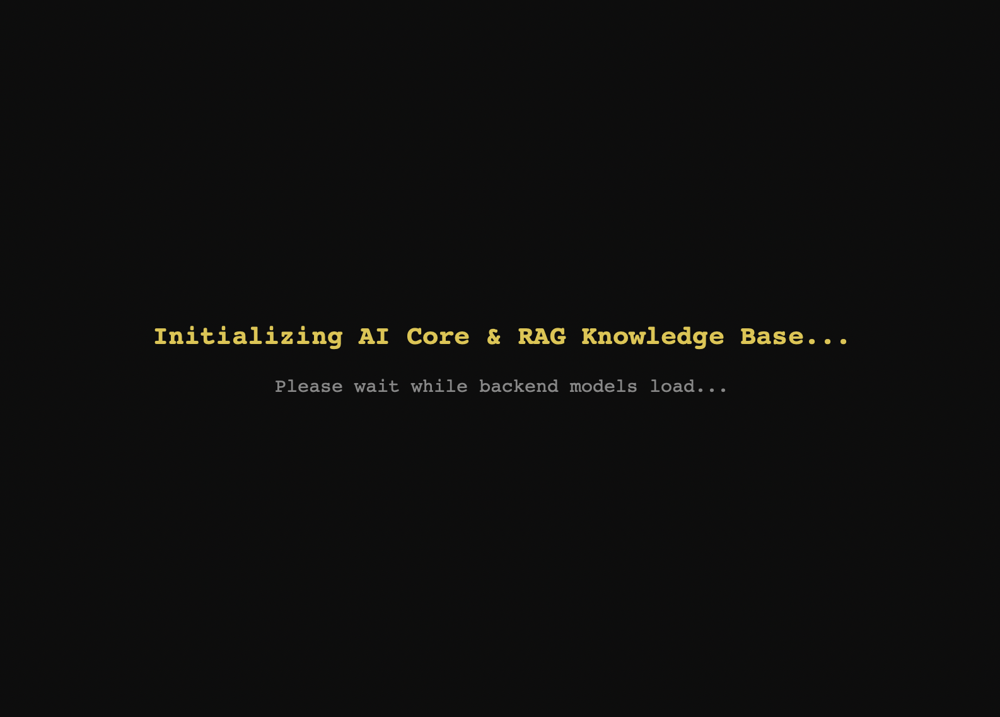
</p>


8. Once initialization completes, the status will update to `SYSTEM READY`.
<p align="center">
  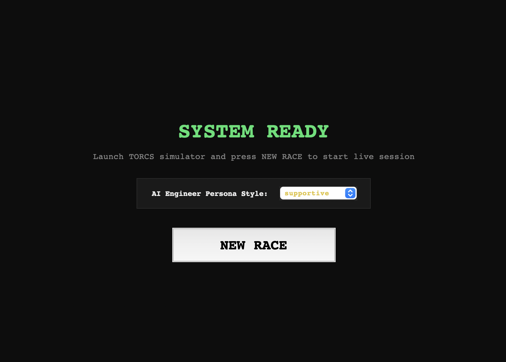
</p>

> **Note on Troubleshooting**: If the GUI fails to display `SYSTEM READY` or throws an error during initialization, check the underlying terminal output for specific error logs (e.g., missing dependencies, unstarted Ollama service, or socket port conflicts).

#### Step 3: Launch TORCS Simulator
Once the Dashboard displays **`SYSTEM READY`**, launch TORCS simulator (for detailed step-by-step screenshots, refer to [Section 2.2: Configuring TORCS Race & Telemetry Server](#22-configuring-torcs-race--telemetry-server)).

1. Launch **TORCS** (wtorcs.exe)
2. Navigate to: **Race** $\rightarrow$ **Quick Race** $\rightarrow$ **Configure Race**
3. **Select Track:** **Olethros Road 1**
4. **Select Drivers:** Make sure `scr_server 1` is selected and added to the driver list. This enables the UDP socket server for AI driver integration.
5. Click **New Race**
6. The simulator will pause and display: `Initializing Driver scr_server 1`
7. When TORCS displays the screen showing `Initializing Driver scr_server 1...`, switch back to the **Dashboard GUI** and click the **New Race** button.
<p align="center">
  
  
</p>


8. Upon a successful UDP handshake, the application will transition to the **Live Telemetry Dashboard**, indicating real-time data streaming is active and the session is ready to play.
<p align="center">
  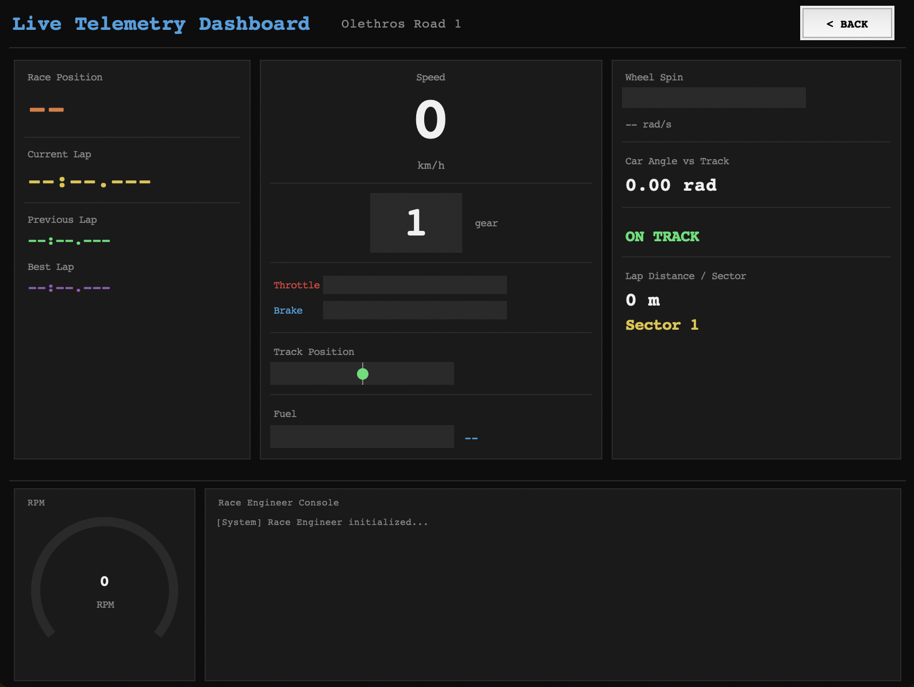
</p>


> **Connection Retry Warning:** On occasion, the UDP handshake between TORCS and the middleware may disconnect immediately after connecting. If the session drops, simply return to TORCS, re-select **New Race**, and click **New Race** on the Dashboard again to retry the handshake.
<p align="center">
  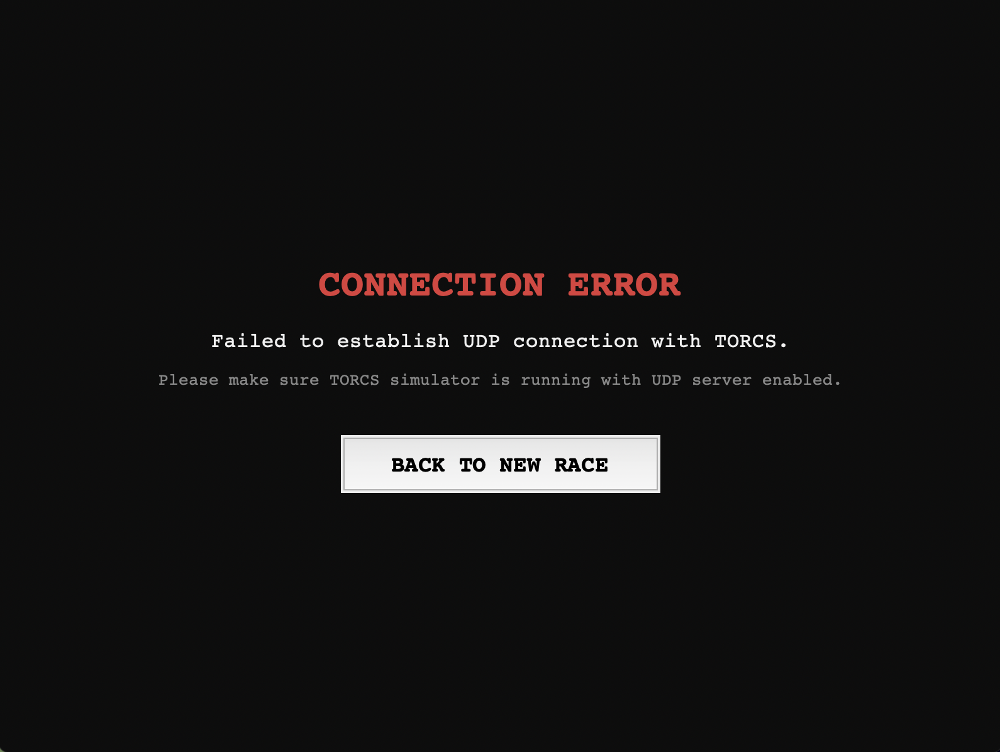
</p>

---

### 5.2 TORCS Game Controls & Display Shortcuts

#### Primary Driving Controls
*(Note: To reverse the vehicle, use `Z` to shift down past Neutral into **Reverse (R)** gear.)*

| Key / Button | Vehicle Action |
| :--- | :--- |
| $\uparrow$ | **Throttle** (Accelerate) |
| $\downarrow$ | **Brake** |
| $\leftarrow$ | **Steer Right** |
| $\rightarrow$ | **Steer Left** |
| `A` / `a` | **Shift Up** |
| `Z` / `z` | **Shift Down** (Keep pressing to reach **R** gear for reverse) |

#### In-Game Camera & Display Shortcuts
Pressing **`F1`** during a race opens the in-game **Keys Definition** menu.

<p align="center">
  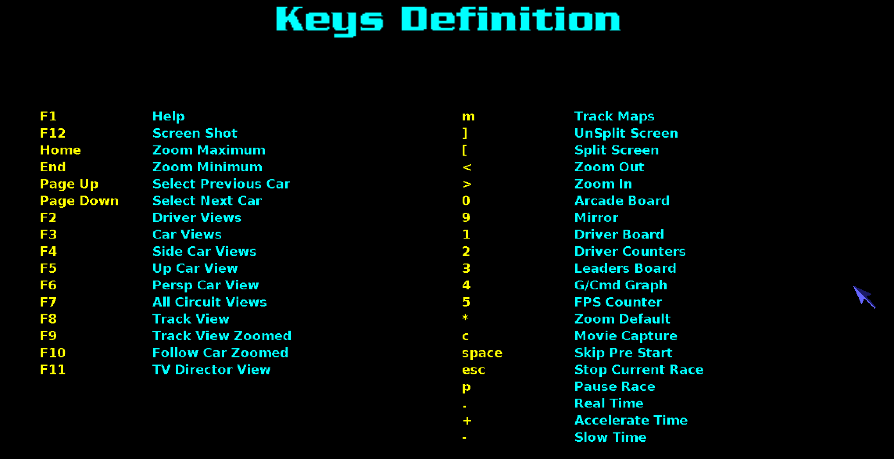
</p>

## 6. Expected Results & Verification
You can verify that the system is operating correctly by cross-referencing your terminal output with the expected runtime execution logs below:

### 6.1 Initialization & RAG Knowledge Base Loading
When you click **Start System** on the Dashboard GUI, the terminal will log the local HuggingFace / Pygame imports, load the Ollama model, and index the RAG knowledge chunks:
```text
[Main] Launching Dashboard GUI directly...
[Main] User clicked Start. Beginning AI Core & RAG Initialization...
pygame 2.6.1 (SDL 2.28.4, Python 3.13.1)
[Ollama] Initializing local Granite engine (granite3-dense:2b)...
[Ollama SUCCESS] Model 'granite3-dense:2b' loaded successfully into memory.
Knowledge base loaded: 133 chunks indexed
```
---
### 6.2 Handshake & Multiprocessing Input Startup
When clicking **New Race**, the `Client` executes UDP handshake polling on port `3001`. The middleware includes built-in safeguards for connection timeouts and incomplete session cleanups:

**Handshake Polling & Handshake Recovery:**
```text
[Main] New Race clicked! Creating TORCS Client & Data Pipeline...
[Client] Connecting to TORCS on 127.0.0.1:3001...
[AI Thread] Async Consumer active. Listening to shared_event_queue...
[Client Warning] No response from TORCS, retrying handshake...
[Client] Handshake successful!
[InputHandler] Multiprocessing pynput listener started successfully.
```

**Invalid Session Cleanup:** If a session drops immediately after connecting, tiny invalid logs are automatically purged to keep the storage clean:
```text
[Client Error] Connection Lost: TORCS stopped sending data for >5 seconds.
Too few data, file deleted
```

---
### 6.3 Real-Time Coaching
During an active race, the terminal logs real-time interaction between the **Fast Layer** (low-latency safety alerts) and the **Slow Layer** (LLM-based sector race engineering):
```text
# Slow Layer: Complex LLM Sector Analysis
[Slow Layer Feedback]: You're losing significant time in Sector 1, especially between 0m to 2094m. Let's focus on improving your entry into the first chicane.
Speaking audio: AI Coaching Speech

# Fast Layer: Instant Event Alerts
[Fast Layer] Brake NOW! (turn3)
Speaking audio: brake_now
[Fast Layer] Wrong way - turn around
Speaking audio: wrong_way
[Fast Layer] Shift up.
Speaking audio: shift_up
[Fast Layer] Shift down.
Speaking audio: shift_down
[Fast Layer] You are off track
# Off-track remains a dashboard/log event; no off-track speech is played.

# Audio Queue Management (Skipping Stale / Outdated Audio Alerts)
[Timeout Dropped] AI Coaching Speech is too old (2.84s old), skipping.
```

Gear conditions must remain stable for `0.6 s`. `shift_up` requires at least `8800 RPM`, `70%` throttle, and a settled on-track line. `shift_down` requires at most `4500 RPM`, at least `30%` brake, released throttle, a safe road speed, and a settled on-track line. Only one downshift is announced per continuous braking episode. A wrong-way prompt requires at least `10 m` of measured reverse track progress above `20 km/h` for `1.5 s`, preventing stationary turns and momentary spins from producing false warnings.

<p align="center">
  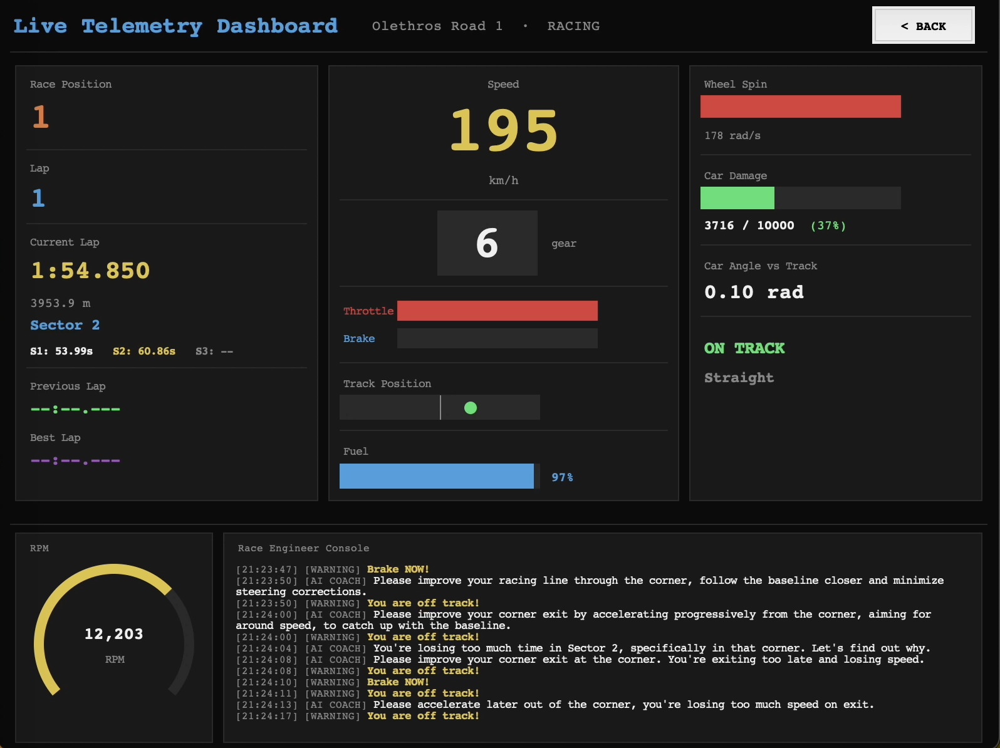
</p>

---
### 6.4 Post-Race Summary & Graceful System Shutdown
When TORCS signals the end of a race session, the system transitions to `GameStatus.FINISHED`, compiles a post-race summary, and safely releases system resources:

```text
[Client] Race ended by TORCS signal.
Data saved successfully and safely! Absolute file path: .../telemetry_20260729_233538.csv
[Dashboard] GameStatus.FINISHED detected. Switching to Summary Page.

# AI Summary Generation
[AI] Compiling Macro Lap Summary Review
[AI SUCCESS] Summary successfully generated and saved to data/lap_summary.json.

# Graceful Resource Cleanup
[Audio] Initiating emergency forced shutdown...
[Audio] Terminated active background 'say' instances.
[Main] System halted cleanly.
```

<p align="center">
  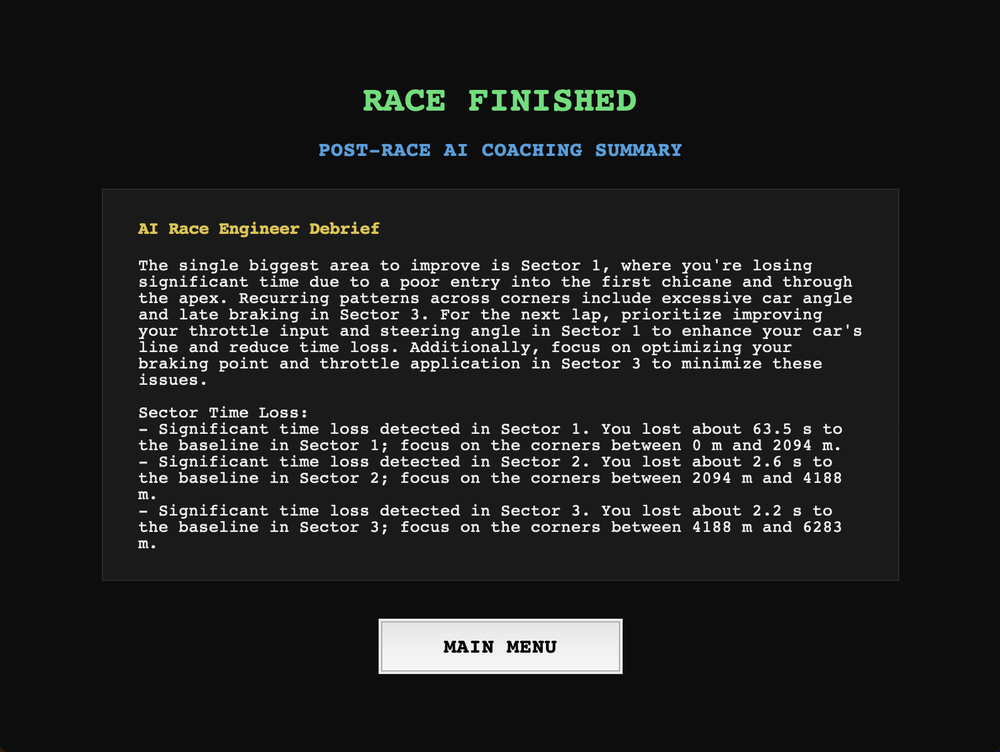
</p>

> **macOS Accessibility Notice:** Since the middleware uses global keyboard listeners (`pynput`) for input monitoring, macOS will prompt you for permission or display a warning: `This process is not trusted! Input event monitoring will not be possible...`
**Fix:** Go to **System Settings** $\rightarrow$ **Privacy & Security** $\rightarrow$ **Accessibility** (and **Input Monitoring**), toggle **ON** the switch for your terminal app (e.g., Terminal, iTerm2, or VS Code), then restart the terminal and re-run `python main.py`.

## Appendix: Acquiring Expert Telemetry

To evaluate player performance against a competitive benchmark, expert baseline telemetry is collected from **Ahura** (a Java-based champion agent for TORCS) using a **Cross-Language Sidecar Pattern**.


### A. Technical Overview (Data Decoupling & Protocol Alignment)

* **Java UDP Broadcast:** Ahura's core communication module (`Client.java`) is extended to broadcast real-time telemetry packets and control inputs over UDP on Port `3002`.
* **Python Sidecar Listener:** A dedicated background thread in Python listens on Port `3002`, asynchronously parsing, cleaning, and logging the incoming stream to CSV.

---

### B. Step-by-Step Recording Guide

#### Step 1: Initialize TORCS Server
Follow [Section 2.2: Configuring TORCS Race & Telemetry Server](#22-configuring-torcs-race--telemetry-server) until TORCS displays:
```text
Initializing Driver scr_server 1...
```
#### Step 2: Start Python Receiver Sidecar
Open a new terminal tab/window and run:
```bash
cd /path/to/your/repository
cd Baseline/Python
python3 client.py
```
*(Verify the terminal outputs: Waiting for data at port 3002...)*

#### Step 3: Launch Ahura Java Agent
Open another terminal tab/window and execute:
```bash
cd /path/to/your/repository
cd Baseline/Ahura
java -cp bin ahuraDriver.Client ahuraDriver.DriverControllerE6 host:127.0.0.1 port:3001
```

#### Step 4: Verification & Output Log
Once connected, Ahura will take control of the car in TORCS. The Python listener will continuously capture telemetry and save the final benchmark dataset to:
```text
Baseline/Python/expert_data/expert_data.csv
```
